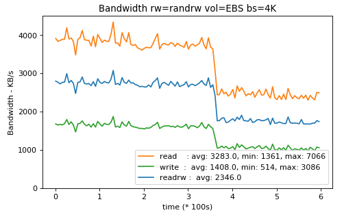
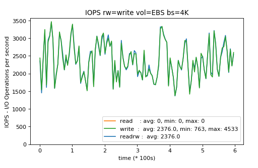

# fio-report-tool

One Another simple python script to visualize FIO - Flexible I/O Tester log.

Usage:

For Bandwidthd:
fio-report.py -f log_name_bw.log -b 4K

For IOPS:
fio-report.py -f log_name_iops.log -b 4K

4K is the block size used for testing. FIO doesn't store that.

The script generates charts from logs only if FIO was used with specific configuration.
Chart is saved to ${log_name}.png

Example screenshots:

TODO
- upload example configuration
- add option to generate 2 graphs together for comparision purposes (e.g. Elastic Block Storage vs Ephemeral)
- describe used functions
