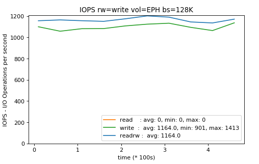

# fio-report-tool

One Another simple python script to visualize [FIO](https://github.com/axboe/fio)  - Flexible I/O Tester logs.


<b>Usage:</b>

For Bandwidthd:

```
python fio-report.py -f log_name_bw.log -b 4K
```

For IOPS:

```
python fio-report.py -f log_name_iops.log -b 4K
```

4K is the block size used for testing (defined in *.fio file or from cli). FIO doesn't store that value. Must be remembered and used during plot generation.


<b>Warnings:</b>

<i>1. The script generates charts from logs only if FIO was used with specific configuration.</i>

<i>2. Script generate flattened charts to make it more clear. Some drops or peak may be not visible</i>

<i>3. Charts looks good for 10 minutes period. Other timespan haven't been tested </i>

To run fio testing using prepared templates:

1. Assure that at required space is available at /ephemeral (3x16GB)
2. Mount EBS volume into /mnt/ebs-disk-benchmark. There must be free space (3x16GB)
3. Run fio using required configuration file as an argument:

```
fio 4k-test.fio
```

4. To run for blocksize in the separete folder run:

```
fio 128k-test.fio
```

This configuration creates a separate log file for each of the test from the file.


Chart is saved as ${log_name}_${block_size}.png so can be run in loop.


Examples of graphs generated by the tool:





TODO
- add option to generate 2 graphs together for comparision purposes (e.g. Elastic Block Storage vs Ephemeral)

